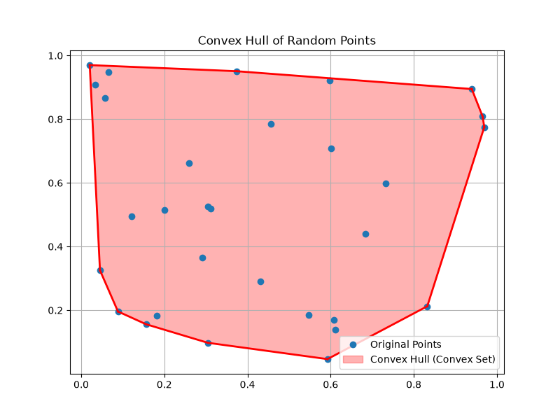
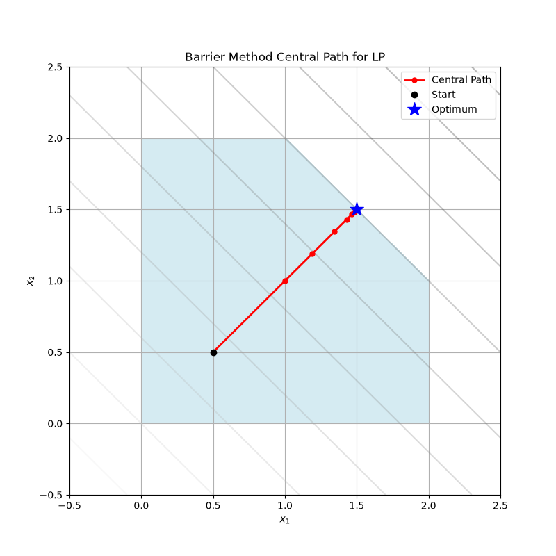
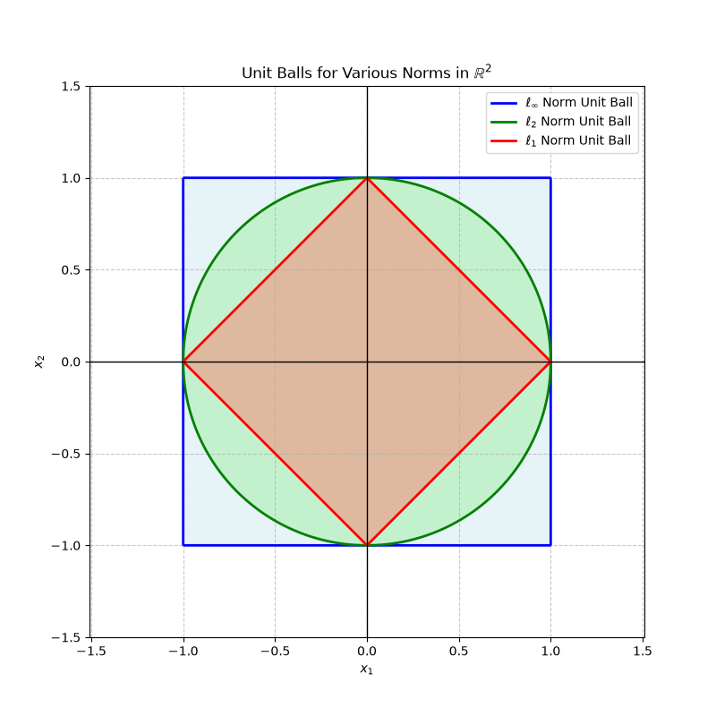
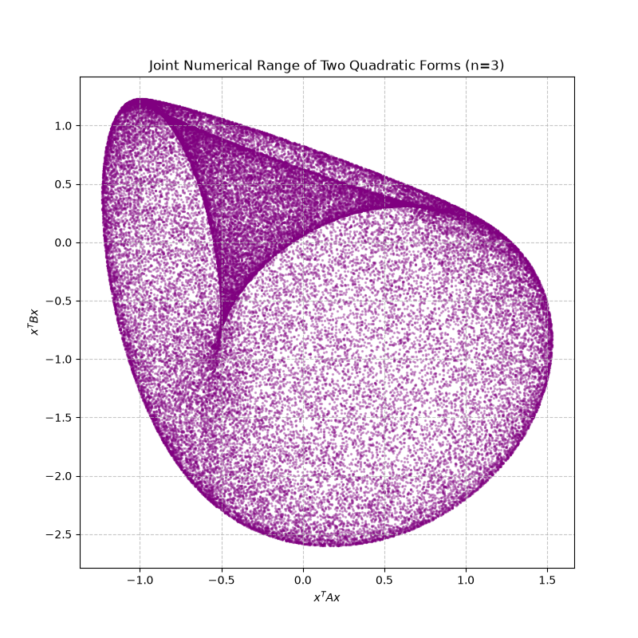

# Convex Optimization Research Project

This project is dedicated to researching and implementing optimization algorithms, heavily inspired by and following the structure of the renowned book **"Convex Optimization"** by Stephen Boyd and Lieven Vandenberghe.

## Structure

The repository is organized into `src/cvx_research/` (for Python modules) and `notebooks/` (for interactive Jupyter notebooks), both mirroring the book's parts and chapters. Below is a visual summary of the topics covered:

### Part I: Theory

**Chapter 2: Convex Sets**  
Explores the foundational geometric properties of convex sets, convex hulls, and separating hyperplanes.  


**Chapter 3: Convex Functions**  
Analyzes the properties of convex functions, including Jensen's inequality and epigraphs.  


**Chapter 4: Convex Optimization Problems**  
Focuses on standard forms of optimization problems, such as linear programming (LP) and quadratic programming (QP).

**Chapter 5: Duality**  
Introduces Lagrange dual functions, weak and strong duality, and the Karush-Kuhn-Tucker (KKT) conditions.

### Part II: Applications

**Chapter 6: Approximation and Fitting**  
Covers norm approximation, least-norm problems, and robust penalty functions for data fitting.  


**Chapter 7: Statistical Estimation**  
Applies convex optimization to maximum likelihood estimation, including logistic regression.  


**Chapter 8: Geometric Problems**  
Solves geometric problems such as finding maximum margin classifiers (SVMs) and extreme points.  


### Part III: Algorithms

**Chapter 9: Unconstrained Minimization**  
Implements iterative methods like Gradient Descent, Steepest Descent, and Newton's Method.  


**Chapter 10: Equality Constrained Minimization**  
Extends Newton's method to handle equality constraints via KKT systems and variable elimination.  


**Chapter 11: Interior-point Methods**  
Solves inequality constrained problems using the barrier method, following the central path.  


### Appendices

**Appendix A: Mathematical Background**  
Reviews essential mathematical concepts such as norms, analysis, and unit balls.  


**Appendix B: Problems Involving Two Quadratic Functions**  
Explores the S-procedure and the numerical range of two quadratic functions.  


**Appendix C: Numerical Linear Algebra Background**  
Covers matrix factorizations like Cholesky, LU, and Singular Value Decomposition (SVD).  


## Requirements

This project uses Python. The core dependencies include:
- `numpy`
- `scipy`
- `matplotlib`
- `cvxpy`
- `jupyter`

## Setup

You can install the dependencies using standard pip or `uv`:

```bash
# Using pip
pip install -e .

# Using uv
uv venv
source .venv/bin/activate
uv pip install -e .
```
