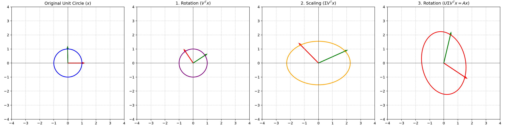

# Appendix C: Numerical Linear Algebra Background

## Overview
Efficiently solving convex optimization problems, especially via interior-point methods, relies heavily on numerical linear algebra. The bottleneck in these algorithms is usually solving a large system of linear equations (the KKT system). This appendix reviews the standard matrix factorizations used to solve these systems efficiently and stably.

### Key Concepts

1. **Solving Linear Equations:** To solve $Ax = b$, we rarely compute $A^{-1}$ explicitly. Instead, we factor $A$ into a product of simpler matrices (e.g., lower and upper triangular) and solve the system using forward and backward substitution.

2. **Cholesky Factorization:** If $A$ is symmetric positive definite ($A \succ 0$), it can be factored as:
   
$$
A = L L^T
$$
   
   where $L$ is a lower triangular matrix. This is the gold standard for solving systems involving the Hessian in unconstrained minimization or the normal equations. It is extremely fast and numerically stable.

3. **LU and $LDL^T$ Factorizations:** 
   - **LU Factorization:** Used for general square, non-singular matrices ($A = PLU$, where $P$ is a permutation matrix).
   - **$LDL^T$ Factorization:** Used for symmetric indefinite matrices (like the KKT matrix in equality constrained optimization). $A = P L D L^T P^T$, where $D$ is block diagonal.

4. **Singular Value Decomposition (SVD):** Any matrix $A \in \mathbb{R}^{m \times n}$ can be factored as:
   
$$
A = U \Sigma V^T
$$
   
   where $U$ and $V$ are orthogonal matrices, and $\Sigma$ is a diagonal matrix of singular values. SVD reveals the fundamental geometric transformation applied by a matrix: a rotation ($V^T$), followed by independent scaling along the axes ($\Sigma$), followed by another rotation ($U$).

5. **Block Elimination and Schur Complement:** When solving systems with block structure (like the KKT system), we can use block elimination. The key algebraic object that arises is the Schur complement $S = C - B^T A^{-1} B$, which allows us to solve a smaller system first.

## Code Example
See `matrix_factorizations.py` for a geometric visualization of the **Singular Value Decomposition (SVD)**. We apply a random $2 \times 2$ matrix to a unit circle of points and decompose the transformation step-by-step into its $V^T$ (rotation), $\Sigma$ (scaling), and $U$ (final rotation) components.

