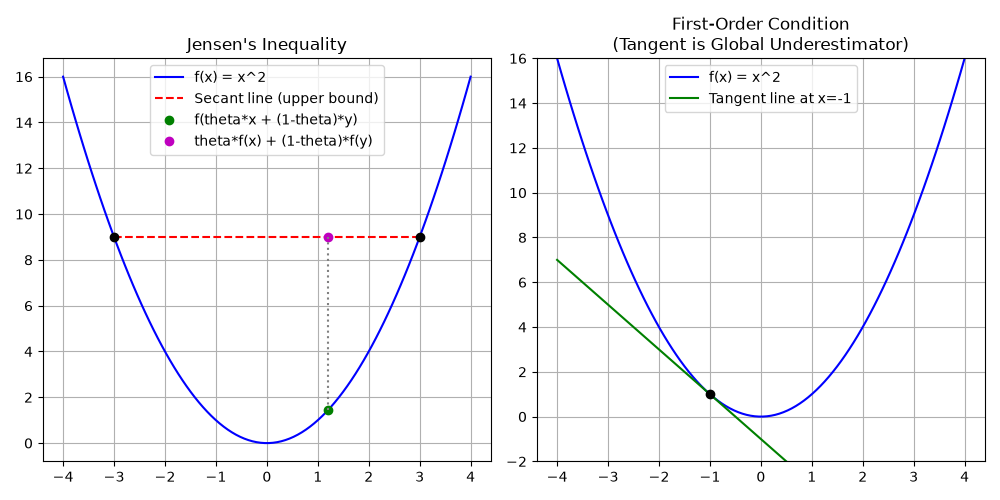

# Chapter 3: Convex Functions

## Overview
A function $f: \mathbb{R}^n \rightarrow \mathbb{R}$ is **convex** if its domain is a convex set and for all $x, y$ in the domain, and any $\theta$ with $0 \le \theta \le 1$, the following inequality holds:

$$
f(\theta x + (1-\theta)y) \le \theta f(x) + (1-\theta)f(y)
$$

This is known as **Jensen's Inequality** in its simplest form. Geometrically, it means that the line segment connecting any two points on the graph of the function lies completely *above* (or on) the graph.

### Key Concepts
1. **Strictly Convex:** The inequality is strictly less than ($<$) for $x \neq y$ and $0 < \theta < 1$. These functions have a *unique* global minimum.
2. **Concave Functions:** $f$ is concave if $-f$ is convex.
3. **First-Order Condition:** For a differentiable function, $f$ is convex if and only if the tangent plane always acts as a global underestimator: 
   
   $$
   f(y) \ge f(x) + \nabla f(x)^T(y - x)
   $$
4. **Second-Order Condition:** For a twice-differentiable function, $f$ is convex if and only if its Hessian matrix is positive semi-definite everywhere in its domain ($\nabla^2 f(x) \succeq 0$).
5. **Operations Preserving Convexity:** Non-negative weighted sums, pointwise maximums, and composition with affine functions all preserve convexity.

## Applications & Problems Solved
- **Guaranteed Global Optima:** The single most important feature of convex functions is that *any local minimum is guaranteed to be a global minimum*. This removes the need for heuristic searches (like simulated annealing) to escape local minima.
- **Machine Learning Loss Functions:** Many fundamental loss functions are designed to be convex so they can be optimized efficiently. Examples include Mean Squared Error (MSE) in linear regression and Cross-Entropy Loss in logistic regression.
- **Risk Aversion in Economics:** Jensen's inequality formally models risk aversion. The expected value of a utility function for a risk-averse person is less than the utility of the expected value.

## Code Example
See `jensens_inequality.py` for a computational and visual demonstration of:
1. Plotting a convex function ($f(x) = x^2$).
2. Visualizing Jensen's Inequality via the secant line.
3. Demonstrating the First-Order Condition (tangent line underestimating the function).

