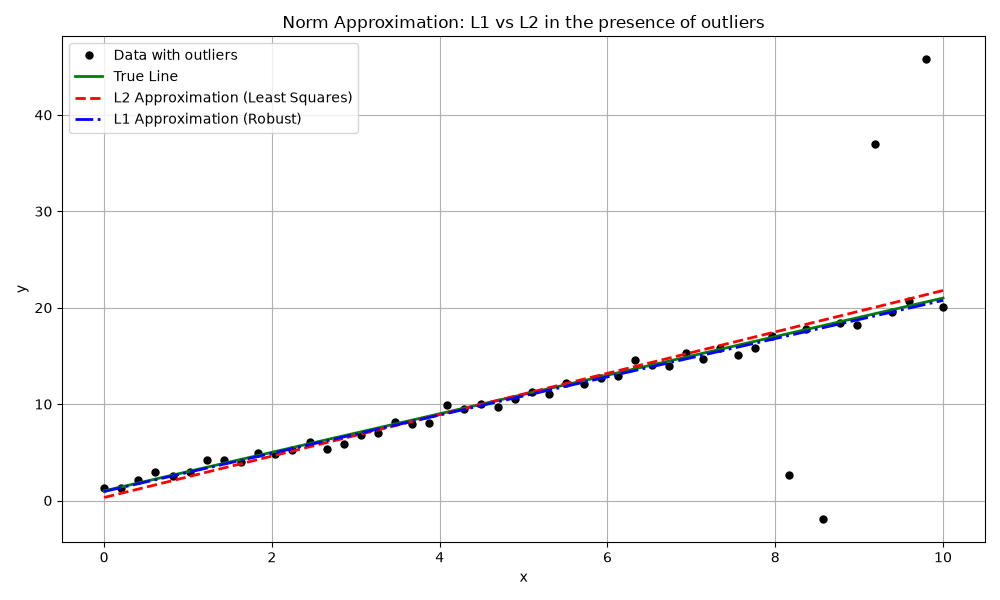

# Chapter 6: Approximation and Fitting

## Overview
In many fields, we face the problem of finding a model or a mathematical function that closely approximates a set of given data points or an underlying true function. Convex optimization provides powerful, systematic tools for solving these **approximation and fitting** problems.

### Key Concepts
1. **Norm Approximation:** The core idea is to find a parameter vector $x$ that minimizes the residual $r = Ax - b$. We measure the "size" of the residual using different norms:
   - **$L_2$ Norm (Least Squares):** Minimizes the sum of squared errors. It is statistically optimal for Gaussian noise but highly sensitive to outliers.
   - **$L_1$ Norm (Robust Approximation):** Minimizes the sum of absolute errors. It is heavily used when the data contains outliers because it doesn't penalize large errors quadratically.
   - **$L_\infty$ Norm (Chebyshev/Minimax Approximation):** Minimizes the maximum absolute error. Used when the worst-case error must be bounded (e.g., in aerospace control systems).

2. **Least-Norm Problems:** When a system of equations $Ax = b$ has infinitely many solutions (underdetermined), we often want the "simplest" or "smallest" solution by minimizing $\|x\|$. 
   - Minimizing $\|x\|_2$ spreads the values out.
   - Minimizing $\|x\|_1$ promotes **sparsity** (solutions where many entries are exactly zero).

3. **Regularized Approximation:** Instead of just minimizing the error $\|Ax - b\|$, we minimize a combination of the error and a penalty on the size of $x$:
   
   $$
   \text{minimize} \quad \|Ax - b\|_2^2 + \gamma \|x\|
   $$
   
   - If we penalize $\|x\|_2^2$, this is **Tikhonov Regularization (Ridge Regression)**, which prevents overfitting.
   - If we penalize $\|x\|_1$, this is **Lasso**, which automatically performs feature selection by driving some coefficients to zero.

## Applications & Problems Solved
- **Machine Learning & Statistics:** Linear regression, robust regression, and feature selection (Lasso).
- **Signal Processing:** Signal restoration and compressed sensing (recovering sparse signals from few measurements).
- **Control Engineering:** System identification (finding a mathematical model that explains observed system behavior).

## Code Example
See `norm_approximation.py` for a demonstration of how different norms behave when fitting a line to data with **outliers**. We compare standard Least Squares ($L_2$) versus Robust Approximation ($L_1$).

