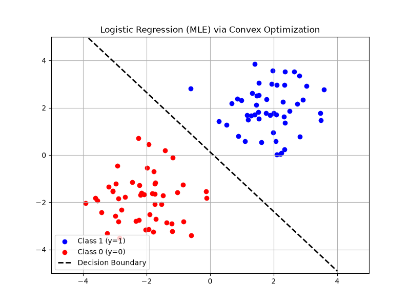

# Chapter 7: Statistical Estimation

## Overview
This chapter explores how convex optimization is deeply intertwined with statistics, particularly in estimating parameters from data and making optimal decisions under uncertainty. 

### Key Concepts
1. **Maximum Likelihood Estimation (MLE):** Given observed data $y$, we want to find the parameters $x$ of a statistical model that maximize the probability of observing that data. Taking the negative log of the likelihood often results in a convex function.
   
   $$
   \text{minimize} \quad -\log P(y | x)
   $$

2. **Maximum A Posteriori (MAP) Estimation:** Similar to MLE, but incorporates prior knowledge about the parameters $x$ (acting as regularization).
   
   $$
   \text{minimize} \quad -\log P(y | x) - \log P(x)
   $$

3. **Hypothesis Testing & Detector Design:** Designing optimal rules for classifying signals (e.g., Radar detection, medical testing) often boils down to linear programming or convex optimization to minimize the probability of false alarms or missed detections.

4. **Experiment Design:** When taking measurements is expensive, convex optimization can determine the optimal set of experiments to perform to gain the most information (minimizing the variance of the estimator). This includes A-optimal, D-optimal, and E-optimal designs.

## Applications & Problems Solved
- **Machine Learning (Logistic Regression):** Logistic regression is fundamentally just MLE for a Bernoulli distribution. Since the negative log-likelihood is convex, we can solve it globally.
- **Sensor Placement:** Experiment design helps determine exactly where to place sensors (e.g., weather stations, structural monitors) to minimize uncertainty about the environment.
- **Communications:** Optimal detector design is used in modern digital receivers to recover bits from noisy signals.

## Code Example
See `statistical_estimation.py` for a demonstration of **Logistic Regression** solved via Convex Optimization (Maximum Likelihood Estimation). We generate a linearly separable binary dataset, formulate the negative log-likelihood in `cvxpy`, and plot the resulting decision boundary.

