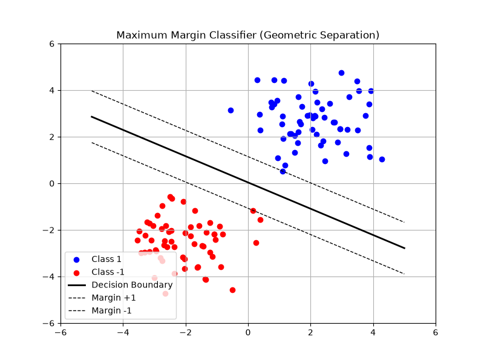

# Chapter 8: Geometric Problems

## Overview
This chapter explores how convex optimization can be used to solve a wide variety of problems involving geometry. Geometric problems are fundamental to fields like computer graphics, robotics, machine learning, and facility location.

### Key Concepts
1. **Projection and Distance:** Finding the closest point in a convex set to a given point (projection) or finding the minimum distance between two disjoint convex sets.

2. **Extremal Volume Ellipsoids:** 
   - **Minimum Volume Covering Ellipsoid (MVCE):** Finding the smallest ellipsoid that contains a given set of points.
   - **Maximum Volume Inscribed Ellipsoid:** Finding the largest ellipsoid that fits entirely inside a convex polyhedron.

3. **Centering:** Finding the "center" of a convex set (like the analytic center), which is heavily used in interior-point methods for solving optimization problems.

4. **Classification & Separation (Support Vector Machines):** Given two sets of points, finding a hyperplane that separates them. The **Maximum Margin Classifier** finds the separating hyperplane that maximizes the distance to the closest points of either set.

$$
\begin{array}{ll}
\text{minimize} & \frac{1}{2} \|w\|_2^2 \\
\text{subject to} & y_i(w^T x_i + b) \ge 1, \quad i=1,\dots,N
\end{array}
$$

5. **Placement and Facility Location:** Determining optimal locations for facilities (e.g., warehouses, cell towers) to minimize the sum of distances or maximum distance to a set of targets.

## Applications & Problems Solved
- **Machine Learning:** Support Vector Machines (SVMs) are fundamentally geometric problems of finding maximum-margin separating hyperplanes.
- **Robotics & Path Planning:** Collision detection often relies on computing the distance between two convex sets representing robot parts and obstacles.
- **Computational Geometry:** Bounding boxes, bounding spheres, and bounding ellipsoids are used to simplify complex 3D models for fast rendering and physics simulations.

## Code Example
See `geometric_problems.py` for a demonstration of a **Maximum Margin Classifier (Linear SVM)**. We generate two sets of points and use convex optimization to find the optimal separating hyperplane along with its margins.

