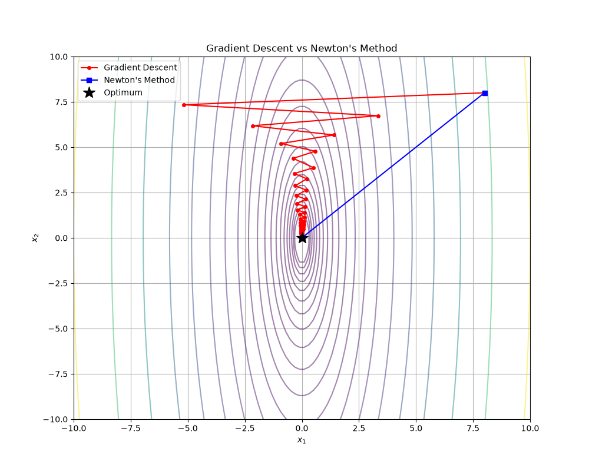

# Chapter 9: Unconstrained Minimization

## Overview
This chapter marks the beginning of Part III: Algorithms. We focus on solving the unconstrained optimization problem:

$$
\text{minimize} \quad f(x)
$$

where $f: \mathbb{R}^n \to \mathbb{R}$ is convex and twice continuously differentiable. We assume an optimal point $x^\star$ exists. 

### Key Concepts

1. **Optimality Condition:** For an unconstrained problem, the necessary and sufficient condition for $x^\star$ to be optimal is simply that the gradient vanishes:

$$
\nabla f(x^\star) = 0
$$

2. **Descent Methods:** Algorithms that produce a sequence $x^{(k)}$ where $f(x^{(k+1)}) < f(x^{(k)})$. The update rule is generally:

$$
x^{(k+1)} = x^{(k)} + t^{(k)} \Delta x^{(k)}
$$

   where $\Delta x^{(k)}$ is the **step direction** and $t^{(k)} > 0$ is the **step size** (found via exact or backtracking line search).

3. **Gradient Descent:** The simplest descent method where the step direction is the negative gradient:

$$
\Delta x = -\nabla f(x)
$$
   
   - **Pros:** Simple to compute.
   - **Cons:** Can be very slow (zigzagging) if the condition number of the Hessian $\nabla^2 f(x)$ is large (i.e., poorly scaled problems).

4. **Newton's Method:** Uses the second derivative (Hessian) to form a quadratic approximation of $f$ near $x$. The step direction is:

$$
\Delta x_{\text{nt}} = -[\nabla^2 f(x)]^{-1} \nabla f(x)
$$
   
   - **Pros:** Affine invariant (scaling doesn't affect it). Extremely fast convergence near the optimum (quadratic convergence).
   - **Cons:** Requires computing and inverting the Hessian matrix, which is expensive for high-dimensional problems.

## Applications & Problems Solved
- **Foundational Algorithm:** Newton's method is the core engine inside almost all modern interior-point solvers for constrained convex optimization.
- **Machine Learning:** Variants of Gradient Descent (like SGD, Adam) are the workhorses for training deep neural networks.

## Code Example
See `unconstrained_minimization.py` for a visual comparison between **Gradient Descent** and **Newton's Method** on a poorly conditioned quadratic function. You will clearly see the zigzagging behavior of Gradient Descent compared to the direct, one-step convergence of Newton's Method.

