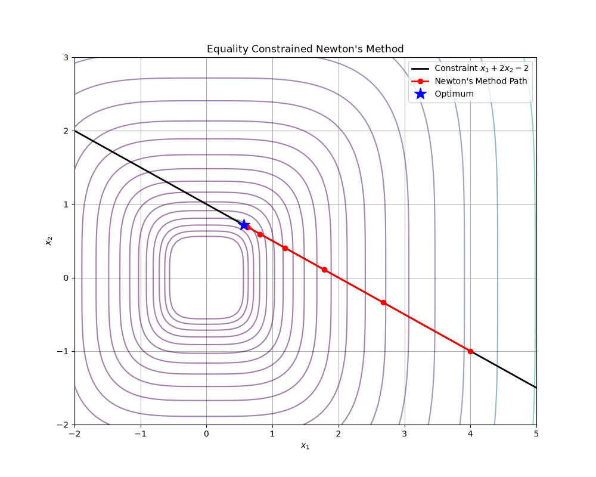

# Chapter 10: Equality Constrained Minimization

## Overview
In this chapter, we extend our optimization algorithms to handle problems with linear equality constraints:

$$
\begin{array}{ll}
\text{minimize} & f(x) \\
\text{subject to} & Ax = b
\end{array}
$$

where $f: \mathbb{R}^n \to \mathbb{R}$ is convex and twice continuously differentiable, and $A \in \mathbb{R}^{p \times n}$.

### Key Concepts

1. **Optimality Conditions:** Applying the KKT conditions to this problem, a point $x^\star$ is optimal if and only if $Ax^\star = b$ and there exists a dual variable $\nu^\star$ such that:

$$
\nabla f(x^\star) + A^T \nu^\star = 0
$$

   This means that at the optimum, the gradient of the objective must be orthogonal to the nullspace of $A$ (it must be a linear combination of the rows of $A$).

2. **Equality Constrained Newton's Method:** This is a natural extension of Newton's method. We replace the objective $f$ with its second-order Taylor approximation and solve the resulting quadratic problem with equality constraints. The Newton step $\Delta x_{\text{nt}}$ and the associated dual variable $w$ are found by solving the **KKT System**:

$$
\begin{bmatrix} 
\nabla^2 f(x) & A^T \\ 
A & 0 
\end{bmatrix}
\begin{bmatrix} 
\Delta x_{\text{nt}} \\ 
w 
\end{bmatrix}
=
\begin{bmatrix} 
-\nabla f(x) \\ 
0 
\end{bmatrix}
$$

3. **Newton Decrement:** The quantity $\lambda(x) = (\Delta x_{\text{nt}}^T \nabla^2 f(x) \Delta x_{\text{nt}})^{1/2}$ acts as an estimate of the suboptimality $f(x) - p^\star$. It is used as a stopping criterion.

4. **Infeasible Start Newton Method:** What if we don't have a starting point $x^{(0)}$ that satisfies $Ax^{(0)} = b$? We can modify the KKT system to simultaneously reduce the objective and the constraint residual $Ax - b$, allowing us to initialize the algorithm anywhere.

## Applications & Problems Solved
- **Building Block for Interior Point Methods:** Equality constrained minimization is the core computational step in barrier methods (Chapter 11) for solving inequality constrained problems.
- **Resource Allocation:** Minimizing cost while exactly satisfying a fixed budget or demand (e.g., portfolio optimization with a fully invested budget).

## Code Example
See `equality_constrained.py` for an implementation of **Feasible Start Newton's Method**. We minimize the non-quadratic convex function $f(x_1, x_2) = x_1^4 + x_2^4$ subject to the linear constraint $x_1 + 2x_2 = 2$. We visualize the objective contours, the constraint line, and how the algorithm converges precisely along the line.

